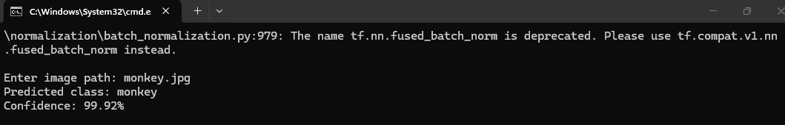
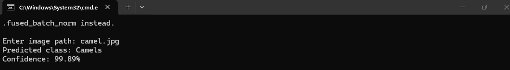
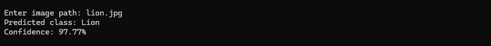

# مشروع تصنيف صور الحيوانات بالذكاء الاصطناعي

هذا مشروع بسيط لتدريب نموذج ذكاء اصطناعي يستطيع التعرّف على ثلاثة أنواع من الحيوانات:

- الجمل (Camels)
- الأسد (Lion)
- القرد (monkey)

تم تدريب النموذج باستخدام موقع **Teachable Machine**، ثم تصديره وتشغيله باستخدام لغة Python لاختبار صور جديدة.

## 1. تدريب النموذج على Teachable Machine

1. افتح موقع [Teachable Machine](https://teachablemachine.withgoogle.com/).
2. اضغط على **Get Started**.
3. اختر **Image Project** ثم **Standard Image Model**.
4. أنشئ ثلاث فئات: `Camels` و`Lion` و`monkey`.
5. أضف مجموعة من الصور المناسبة إلى كل فئة. يمكن رفع صور من الجهاز أو التقاطها بالكاميرا.
6. يفضّل استخدام صور متنوعة من حيث الزاوية والخلفية والإضاءة حتى يتعلم النموذج بصورة أفضل.
7. اضغط على **Train Model** وانتظر حتى ينتهي التدريب. لا تغلق الصفحة أثناء هذه العملية.
8. جرّب بعض الصور داخل الموقع للتأكد من أن النموذج يتعرّف على الحيوانات بصورة صحيحة.

## 2. تصدير النموذج

بعد الانتهاء من التدريب:

1. اضغط على **Export Model**.
2. اختر **TensorFlow**.
3. اختر صيغة **Keras**.
4. اضغط على **Download my model**.
5. فك ضغط الملف وضع `keras_model.h5` و`labels.txt` داخل مجلد المشروع.

ملف `keras_model.h5` هو النموذج المدرّب، أما `labels.txt` فيحتوي على أسماء الفئات.

## 3. ملفات المشروع

- `predict.py`: كود تحميل النموذج واختبار الصور.
- `keras_model.h5`: النموذج الذي تم تصديره من Teachable Machine.
- `labels.txt`: أسماء الفئات الثلاث.
- `requirements.txt`: المكتبات المطلوبة لتشغيل المشروع.
- `camel.jpg`: صورة اختبار للجمل.
- `lion.jpg`: صورة اختبار للأسد.
- `monkey.jpg`: صورة اختبار للقرد.
- `Screenshot_1.png` و`Screenshot_2.png` و`Screenshot_3.png`: صور نتائج الاختبارات.

## 4. تجهيز بيئة التشغيل

يُنصح باستخدام **Python 3.13** لتشغيل المشروع.

افتح Terminal داخل مجلد المشروع، ثم ثبّت المكتبات المطلوبة:

```bash
python -m pip install -r requirements.txt
```

إذا كان على الجهاز أكثر من إصدار Python، يمكن استخدام Python 3.13 مباشرة:

```bash
py -3.13 -m pip install -r requirements.txt
```

## 5. تشغيل البرنامج

شغّل الملف بالأمر التالي:

```bash
python predict.py
```

سيطلب البرنامج مسار الصورة:

```text
Enter image path:
```

اكتب اسم الصورة، مثل:

```text
camel.jpg
```

بعد ذلك يعرض البرنامج اسم الحيوان المتوقع ونسبة ثقة النموذج في النتيجة.

## 6. كيف يعمل الكود؟

يقوم ملف `predict.py` بالخطوات التالية:

1. تحميل النموذج من `keras_model.h5`.
2. طلب مسار صورة من المستخدم.
3. تغيير حجم الصورة إلى `224 × 224` بكسل، وهو الحجم الذي يتوقعه النموذج.
4. تحويل الصورة إلى مصفوفة أرقام.
5. تطبيع قيم الصورة لتصبح مناسبة للنموذج.
6. إرسال الصورة إلى النموذج للحصول على التوقعات.
7. اختيار الفئة صاحبة أعلى احتمال.
8. طباعة اسم الحيوان ونسبة الثقة.

## 7. نتائج الاختبارات

تم اختبار النموذج باستخدام ثلاث صور مختلفة.

### الاختبار الأول: القرد

- الصورة المستخدمة: `monkey.jpg`
- النتيجة: `monkey`
- نسبة الثقة: `99.92%`



### الاختبار الثاني: الأسد

- الصورة المستخدمة: `lion.jpg`
- النتيجة: `Lion`
- نسبة الثقة: `97.77%`



### الاختبار الثالث: الجمل

- الصورة المستخدمة: `camel.jpg`
- النتيجة: `Camels`
- نسبة الثقة: `99.89%`



## الخلاصة

تم تدريب نموذج لتصنيف صور الجمل والأسد والقرد باستخدام Teachable Machine، ثم تم تصديره بصيغة Keras وتشغيله بواسطة Python. أظهرت الاختبارات الثلاثة أن النموذج استطاع التعرّف على الصور بنسب ثقة مرتفعة.
